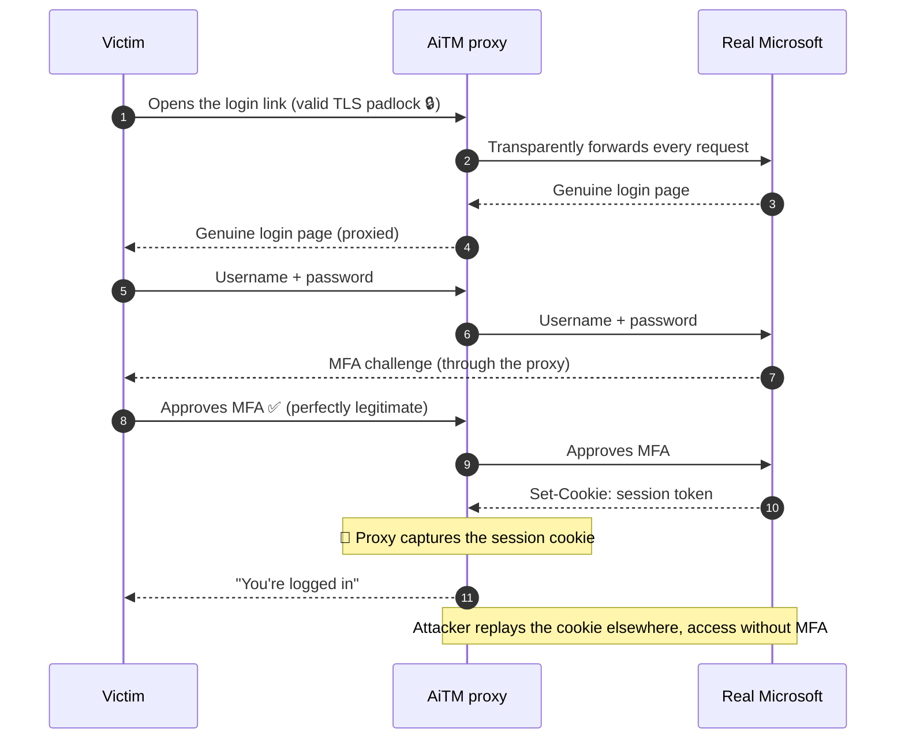
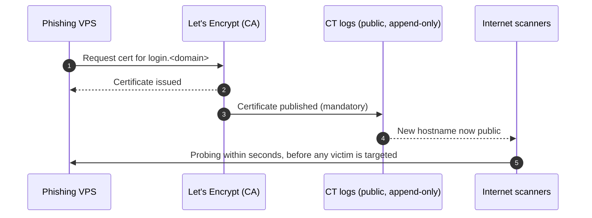

# MFA is not enough

> **An Adversary-in-the-Middle (AiTM) phishing walkthrough: red intuition, blue playbook.**
> How an attacker steals a *live authenticated session* to walk straight past MFA, and, more
> importantly, every signal a defender can use to catch it.


> ⚠️ **Scope & ethics.** Everything here was done in an **authorized learning lab**, against the
> author's **own test account only**, on **disposable infrastructure that has since been destroyed**.
> This repository is a **methodology and defense writeup**. It deliberately ships **no working
> phishlet, no captured credentials, and no turnkey attack kit** (see
> [Appendix B](#appendix-b--why-this-repo-ships-no-working-phishlet)). The goal is to make defenders
> better, not to lower the bar for attackers.

---

## The blind spot: why this matters

Most companies today, and most people, treat multi-factor authentication as a finish line. You turn
on MFA, you tick the compliance box, and the account is filed away as "secure." That belief hides a
real blind spot.

MFA proves **who authenticates**. It says nothing about protecting **what gets issued afterwards**:
the session. Once you have logged in and approved your second factor, the identity provider hands
your browser a **session cookie**, and from that moment on, that cookie *is* your logged-in
identity. Steal it, and you no longer need the password, the phone, or the second factor at all.

That is the gap this writeup walks through. An attacker who never cracks your MFA can still end up
inside your account, because the session your legitimate login produced was quietly copied in
transit. It was reproduced on real infrastructure, and, more usefully, every place a defender can
see it coming is laid out alongside. MFA is necessary. This is why, on its own, it is not enough.

---

## TL;DR

- **MFA is not broken. It is bypassed.** The victim performs a real login and a real MFA approval.
  What the attacker steals is the **session cookie issued afterwards**.
- A stolen session is **portable**. Replayed from another machine, on a different IP, it grants
  access with no login and no MFA.
- The attacker's own public certificate **betrays the infrastructure within seconds** through
  **Certificate Transparency**, the single most reliable blue-team signal here.
- **Only origin-bound MFA (FIDO2 / passkeys) stops this by construction.** Everything else,
  including number matching, is defeated.

---

## 1. How AiTM defeats MFA: the mechanism

Evilginx, and tools like it, is **not** a fake page that copies the login form. It is a
**transparent reverse proxy** sitting between the victim and the real identity provider. The victim
sees the genuine page, served through the proxy.



The key insight: authentication *happens correctly*. The theft is of the artifact minted **after**
authentication, the session.

> 🔵 **Blue team.** This is why **number matching** (approving a code in Authenticator) does **not**
> help against AiTM. The malicious session is minted on the back of an approval the victim made in
> good faith. Anti-MFA-fatigue is not anti-AiTM. Treat *session hijacking*, not *MFA prompts*, as
> the threat.

---

## 2. Part 1: building it locally

Before touching the internet, the whole chain was built and debugged **offline** (a local VM,
self-signed certs, `/etc/hosts`). Two problems dominated, and both teach a defender something.

### 2.1 The real fight: capturing the session cookies

Modern Microsoft session cookies carry the **`__Host-` prefix** (for example `__Host-MSAAUTH`).
That prefix enforces strict rules: no `Domain` attribute, `Secure` required, host-only. To re-serve
such a cookie on a phishing hostname the proxy must rewrite it, which violates the `__Host-` rules,
so a proxy that matches cookies **by exact name** silently fails to track it as a token. Result:
username captured, `tokens: empty`, forever.

The fix is to stop matching by exact name and **capture by regular expression** instead:

```yaml
# ILLUSTRATIVE / REDACTED, concept only, NOT a working phishlet
auth_tokens:
  - domain: '.live.com'
    keys: ['<completion-trigger-cookies>']   # tells the proxy when capture is "complete"
  - domain: 'login.live.com'
    keys: ['.*:regexp']                       # capture ALL cookies by regex, not by exact name
```

| Capture strategy | `__Host-` session cookie | Outcome |
|---|---|---|
| Exact name | rewrite breaks the prefix, not tracked | `tokens: empty` ❌ |
| Regex (`.*:regexp`) | all cookies grabbed regardless of name | session captured ✅ |

> 🔵 **Blue team.** The `__Host-` prefix is genuine hardening, but it hardens **capture**, not
> **replay**. Once the cookie is re-planted host-only, `Secure`, path `/`, it is accepted. So do
> **not** rely on cookie prefixes to stop session replay. Bind sessions to something the attacker
> cannot move: device-bound tokens, Continuous Access Evaluation (CAE), short session lifetimes, and
> re-auth on risk.

### 2.2 Two flows, two phishlets

A subtle trap: **personal** and **work/school** Microsoft accounts use different login flows, hence
different proxy targets. Pointing the wrong flow at the wrong config leaks the victim straight to
the real Microsoft before the password step.

| | Work / school (Entra ID) | Personal (MSA) |
|---|---|---|
| Login domain | `login.microsoftonline.com` | `login.live.com` |
| Session cookies | `ESTSAUTH`, `ESTSAUTHPERSISTENT`, … | `__Host-MSAAUTH`, `WLSSC`, `PPLState`, … |

> 🔵 **Blue team.** A modern M365 sign-in **spreads across many domains** (`login.microsoftonline.com`,
> `login.live.com`, `logincdn.msauth.net`, `account.microsoft.com`, and more). An AiTM proxy must
> cover them all, which is exactly why these kits are fragile and constantly maintained. Sudden auth
> traffic to a single unfamiliar host that fans out to Microsoft endpoints is anomalous.

---

## 3. Part 2: going live

Local proves the mechanism. Live proves the **danger**: a real domain and a real, publicly-trusted
certificate, so the victim sees a valid green padlock with nothing to install.

### 3.1 Choosing a VPS: the KYC reality

Not all hosting is equal for a throwaway box, and the friction is mostly about **payment and
identity checks**, not price.

| Provider | ID / KYC tendency | Notes |
|---|---|---|
| Big-cloud free tiers (AWS/GCP/Oracle) | risk-based | AUP forbids phishing and they scan, so you burn a *verified* account |
| Scaleway | heavier KYC, especially with virtual/prepaid cards | frequent ID request |
| Hetzner | lighter, card and address often enough | ID only on flagged accounts |

The single biggest KYC trigger is the **payment method**. A virtual, disposable, or prepaid card
reads as fraud risk and *invites* an ID check. A normal card on a low-risk provider usually goes
through untouched.

**How real attackers sidestep all of this:** they do not play the KYC game at all. They use
bulletproof hosting, stolen or synthetic identities, compromised servers, and crypto payment. The
disposable-but-legitimate box in this lab is the training-wheels version of that.

> 🔵 **Blue team.** You will rarely block "the host." Focus on **outcomes**: newly-seen hosting ASNs
> presenting Microsoft-shaped login flows, brand-new domains, and the certificate signal in section 4.

### 3.2 The domain: generic, never look-alike

The phishing domain does **not** need to resemble Microsoft. The victim sees the real page served by
the proxy, so the address bar can be any believable but generic portal name. A brand look-alike
(`microsoft`, `office`, `live`, `outlook`) buys nothing and costs everything: instant takedown
(Microsoft actively monitors) and legal exposure.

> 🔵 **Blue team.** Do not anchor detection on look-alike strings alone. Mature operators use clean
> generic domains. Anchor on **behavior and certificates**, not on the name.

### 3.3 The real certificate: the game-changer

With a public domain and **Let's Encrypt** (`autocert`, HTTP-01), the phishing hosts get a valid,
publicly-trusted certificate automatically, with no CA to install on the victim's machine (the thing
that gave the local lab away). This is what makes AiTM realistic in the wild, and it is also its
undoing. See section 4.

> 🔵 **Blue team.** The absence of TLS warnings is *not* reassurance. A valid padlock proves domain
> control, nothing about legitimacy.

---

## 4. 🎯 The revelation: Certificate Transparency

The moment the certificate was issued, the box was hit, within seconds, before any lure was ever
sent, by a wave of internet-wide scanners.



**Why:** every publicly-trusted certificate is **mandatorily logged** in append-only
**Certificate Transparency** logs (the mechanism that stops a CA from issuing certs in secret).
Scanners watch that feed in real time and pounce on fresh hostnames.

These were **not** the CA re-checking legitimacy (the CA validates domain control **once**, at
issuance), and **not** attackers targeting *us* specifically. They were indiscriminate automation
triggered by CT:

| User-agent seen | Who | Intent |
|---|---|---|
| `CT-WP-Scanner/1.0` | CT-log monitor | index new certs, probe hostnames |
| `l9scan/leakix.net` | LeakIX (exposure search engine) | catalog exposed services and leaks |
| `ForestEngine`, `rust_sniffer` | research / hobby crawlers | reconnaissance, indexing |
| browser-like UAs from cloud IPs | opportunistic bots | hunt fresh login pages |
| *(silent)* | anti-phishing / brand protection | find phishing infra to take it down |

You can even find the trail yourself, after the fact, on **[crt.sh](https://crt.sh)**. The hostnames
are public and permanent.

> 🔵 **Blue team, the headline.** Do **not** hunt for `X-Evilginx` (that legacy header is gone from
> current builds, see [Appendix A](#appendix-a-hardening-against-detection-theory-only)). **Monitor
> Certificate Transparency instead.** Subscribe to CT feeds (for example certstream) and alert on
> newly-issued certs whose hostnames mimic your login surface (`login.`, `sso.`, `account.`, `mail.`).
> Your adversary's own certificate announces the attack before the first email lands.

---

## 5. Proof: capture and replay

On the live box, against the **test account only**:

1. **Capture.** The session was intercepted: three cookies, including the `__Host-MSAAUTH` session
   token (`PPLState`, `WLSSC` alongside). *(No cookie values are published here.)*
2. **Replay.** Those cookies were re-planted in a clean browser on a different machine, then
   `account.microsoft.com` was opened. Result: full access, no login, no MFA.

Two things this proves that the local lab could not:

| Claim | Confirmed by |
|---|---|
| The session is **portable** | replayed from a different machine and a different public IP |
| `__Host-` protects **capture, not replay** | re-planted correctly, accepted without complaint |

> ⚠️ Diagnostic trap: reloading `login.live.com` on its own shows a blank page. That is the auth
> *endpoint*, not a destination. It is **not** a failure. Verify on a resource that *requires* the
> session (`account.microsoft.com`, `outlook.live.com`).

> 🔵 **Blue team.** Because replay is machine- and IP-portable, **detect the session, not the login**:
> impossible travel, a sudden new device or new ASN on an existing session, token reuse from
> unexpected geographies. **Revoke sessions** (not just reset passwords) on suspicion. Continuous
> Access Evaluation shortens the stolen token's useful life.

---

## 6. The defense that holds: origin-bound MFA

Every mitigation above **raises the cost**. Only one **removes the attack class**.

**FIDO2 and passkeys are origin-bound.** The authenticator signs a challenge that is
cryptographically tied to the real origin. On a phishing domain the origin is wrong, so **the key
refuses to sign**. There is no session to steal because there is no successful authentication in the
first place. AiTM cannot proxy its way around that.

| Control | Effect on AiTM |
|---|---|
| Password only | none |
| OTP / push / number matching | bypassed (session stolen after approval) |
| `__Host-` cookie prefix | hardens capture, not replay |
| CT monitoring | detects (does not prevent) |
| **FIDO2 / passkeys (origin-bound)** | prevents by construction ✅ |

> 🔵 **Blue team, do both.** *Prevent* with phishing-resistant, origin-bound MFA (passkeys or
> hardware keys) for anything that matters. *Detect* the rest with CT monitoring, session-anomaly
> analytics, and fast session revocation.

---

## 7. Detection cheat sheet

| Red technique | Blue signal to watch |
|---|---|
| Reverse-proxy AiTM | auth flow fanning out from a single unfamiliar host to Microsoft endpoints |
| Real cert via Let's Encrypt | **CT logs**, a new cert mimicking your login surface |
| Generic disposable domain | newly-registered-domain intelligence, new hosting ASN |
| Session-cookie theft | session anomalies: impossible travel, new device or ASN mid-session |
| Stolen-session replay | token reuse from unexpected geo/IP, revoke sessions, enable CAE |
| Legacy `X-Evilginx` header | unreliable, removed in current builds, do not depend on it |
| Go/TLS stack fingerprint | JARM / JA3S of the proxy, not removable at compile time |

---

## Appendix A: hardening against detection (theory only)

For completeness, the classes of trace an operator would try to reduce, and why the defender should
know them. *No step-by-step recipe is provided.*

- **Binary IOCs.** The once-famous `X-Evilginx` response header (the `cantFindMe()` easter egg) is
  **already gone** from current builds. Auditing the source confirmed it. The only self-identifying
  string that remained was the self-signed CA name in the certificate code, which is irrelevant in
  live mode (the leaf comes from Let's Encrypt) and trivially renamed.
- **Non-removable fingerprint.** The TLS fingerprint (JARM / JA3S) comes from the Go `crypto/tls`
  stack, not from a string, so it survives recompilation. That makes it a **robust** blue signal.
- **Operational filters.** Blocking scanner IP ranges, user-agent filtering, and briefly redirecting
  early visitors are all about surviving the CT-driven scan wave of section 4, which is itself the
  proof that the exposure is real.

> 🔵 The takeaway is symmetric. Every IOC an attacker removes is an IOC a defender should stop relying
> on. The durable signals are the ones nobody can strip: certificates and TLS fingerprints.

## Appendix B: why this repo ships no working phishlet

A complete, working phishlet is a **functional attack artifact**. Publishing one would:

- contradict the entire **defensive** purpose of this writeup;
- go against evilginx community norms, since the official O365 phishlet was **removed from the
  upstream repo in 2021** precisely to raise the barrier;
- add **zero** defensive value that the *concept* (section 2.1) does not already convey.

So this repository documents the **class of problem and its lesson**, not a copy-paste weapon. That
restraint is deliberate, and it is part of the point.

---

## References

- Certificate Transparency: [certificate.transparency.dev](https://certificate.transparency.dev),
  search at [crt.sh](https://crt.sh)
- FIDO2 / WebAuthn (origin-bound authentication): [webauthn.guide](https://webauthn.guide)
- Microsoft: token theft and AiTM guidance, Continuous Access Evaluation (CAE)
- Evilginx by Kuba Gretzky ([@mrgretzky](https://github.com/kgretzky)), used here for authorized,
  educational research only

---

*Authored as an authorized internship lab exercise. Test account only. Infrastructure destroyed after
the exercise. Content licensed CC BY 4.0 (attribution).*
